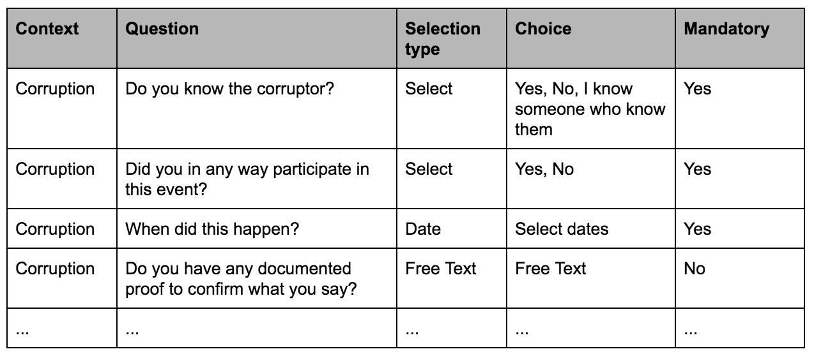

========================================
Whistleblowing Platform Set Up Procedure
========================================

.. ATTENTION::
  This Document is in a work in progress state
  

The most important aspect of your whistleblowing initiative is the definition of the Whistleblowing procedure.

Whistleblowing procedure substantially defines:

* which kind of info you are collecting from whistleblowers
* and which people will take charge of treating those collected info. 

GlobaLeaks has been designed and implemented around those very simple concepts.
Those, in fact, are needed to set up the follwing aspects of your GlobaLeaks installation:

* **Contexts** (link to documentation section on Context Configuration)
* **Questionnaires** (link to documentation section on Questionnaire Configuration)
* **Recipients** (link to documentation section on Users Role Configuration)

Context
-------

A **Context** is the area, category, or topic concerned by the submissions given by the whistleblower through the platform.

Examples of possible Contexts are:

* Corruption in a local municipality
* Environmental pollution in a specific city
* Human rights abuse
* Confidential information about Code of Ethics infringements

A GlobaLeaks installation can have one or more contexts that are strictly related to the **Goals**, **Audience**, and **Whistleblowers** that the initiative is targeting.

Contexts ae the following properties:

* Each Context is defined by a “Short Title” and a “Description” . 
* Each Context can have a differentiated set of Receivers that will receive the submitted material. 
* Each Context is linked with a Questionnaire, which is composed of Submission Fields

Questionnaires and Submission Fields
------------------------------------

**Submission fields** represent the information that the Whistleblower is asked to provide while applying for a submission. They are one of the most important configuration aspects of GlobaLeaks and are the individual components of Questionnaires.
To improve the flexibility of the platform, questionnaires are organized in **Steps**.

It is very important to ask the Whistleblower information that will be useful to the Recipient(s) when assessing and verifying their submission. Think of common questions that may arise when you are dealing with a submission on that specific Context.

While some contexts may have more free text and less mandatory fields, the questions asked to whistleblowers will be increasingly detailed and specific as the Recipient gains experience, in an effort to improve the efficacy of the fact-checking and verification process.
The submission fields are different for each Context of use, so that they can be trimmed, depending on the specific topic.

To simplify the design of questionnaires, steps, and submission fields it is very useful to fill in all the submission fields that you would like to configure for your initiative in the sample form below:

The Selection Type can be any of the following elements that will get displayed to the whistleblower: 

* Text
* Radio Button
* Drop Menu (select)
* Multi Select
* Toggle (checkbox)
* Checkboxes
* Date, Number,  URL, Phone, Email, Heading

.. hint:: Useful Tips on Submission Fields Management
   The organization running the Whistleblowing Initiative should frequently update their Submission fields as their Recipients    learn through experience what information is most crucial for fact-checking submitted materials.
   
   The Recipients should frequently report on how to improve the effectiveness of the Whistleblowers’ submissions fields for      specific Contexts by asking for new or more precise sets of fields.
   
   What are the additional questions you are commonly asking whistleblowers which submit a tip in a certain context? Would it    have saved the Recipient time, If you had asked those questions in the submission phase? If the answer is “yes”, then such    questions should be in the submission fields.

Recipients
----------

The *Recipients* are the people handling fact-checking and publishing of the received submissions.

The chosen policy about Recipient disclosure determines the amount of Recipients’ details to be configured, as shown in the submission page.

Recipient notification
......................

Recipients, by default, receive email notifications in the following cases:

* A new submission has been sent by a whistleblower.
* A new file has been uploaded on an existing submission.
* A new comment has been made on an existing submission.

Recipients, if a PGP Key is configured, will receive the notification encrypted by email and can download the submission files encrypted.

.. ATTENTION::
   To be Completed  

