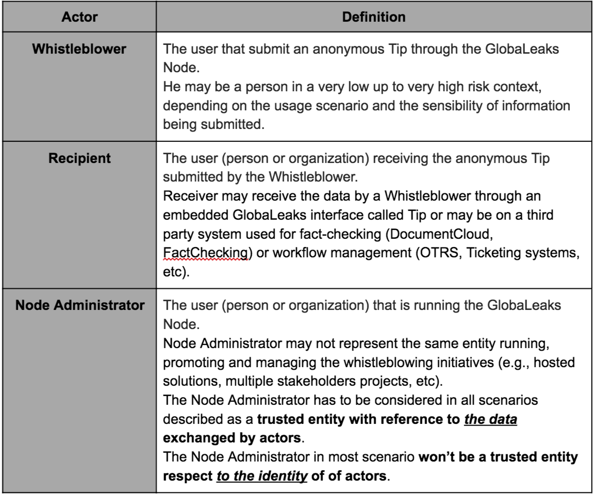

===========================================
GlobaLeaks Threat Model and Security Design
===========================================

.. Important::
  This document is undergoing a revision.
  
Goal
----

This document describes the threat model and security properties of GlobaLeaks 2.x

Introduction
------------

**GlobaLeaks** is an **Open Whistleblowing Framework** that can be used in many different usage scenarios that may require very different approaches to obtain both security and flexibility.
Whistleblowing policies and procedures within a corporation for compliance purposes are reasonably different from the ones of a Media Agency or the ones for Hacktivism initiatives.
Given the flexibility of uses of GlobaLeaks, the threat model considers different usage scenarios as threats can vary.

Actors Matrix
-------------

As a first step we define the *Actors*, that are *the users that interact with GlobaLeaks Node*.

  

