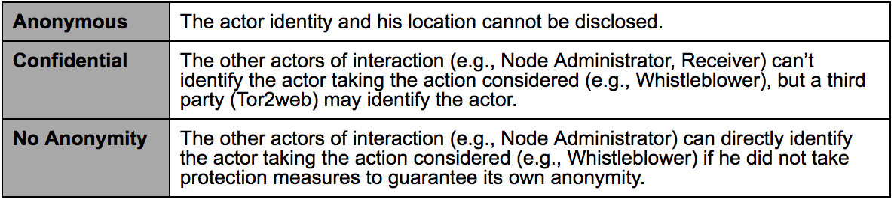
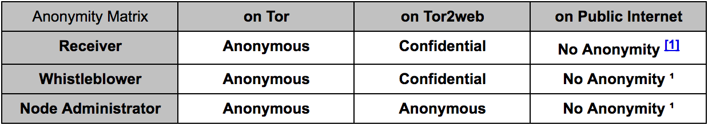
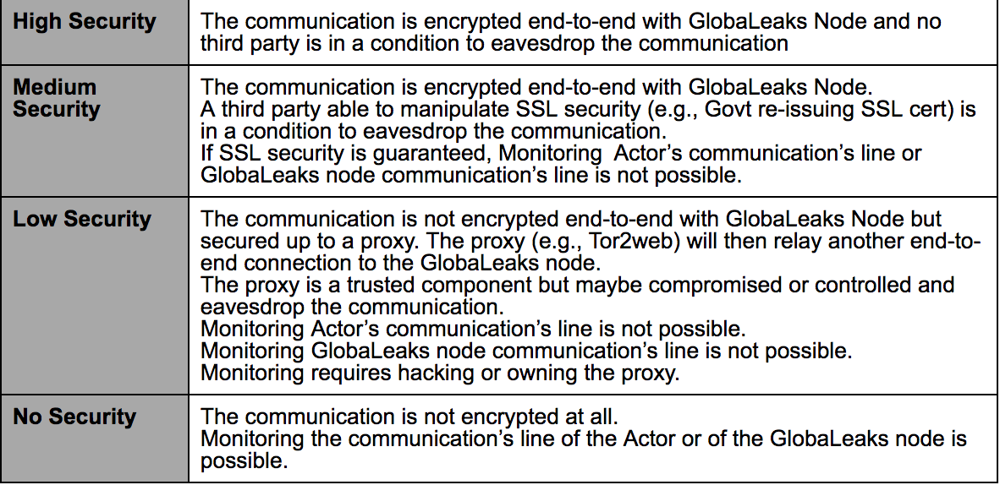
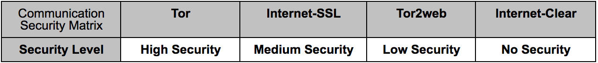
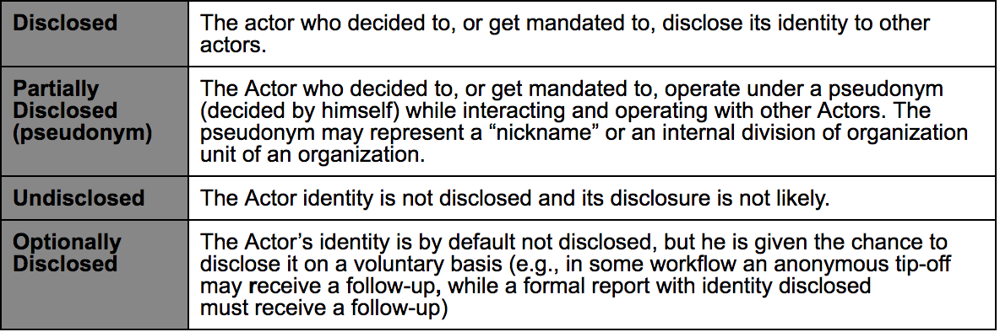

===========================================
GlobaLeaks Threat Model and Security Design
===========================================

.. Important::
  This document is undergoing a revision.
  
Goal
----

This document describes the threat model and security properties of GlobaLeaks 2.x

Introduction
------------

**GlobaLeaks** is an **Open Whistleblowing Framework** that can be used in many different usage scenarios that may require very different approaches to obtain both security and flexibility.
Whistleblowing policies and procedures within a corporation for compliance purposes are reasonably different from the ones of a Media Agency or the ones for Hacktivism initiatives.
Given the flexibility of uses of GlobaLeaks, the threat model considers different usage scenarios as threats can vary.

Actors Matrix
-------------

As a first step we define the *Actors*, that are *the users that interact with GlobaLeaks Node*.

.. image::
  GlobaLeaksActorsMatrix.png
  
It is highly relevant to apply each of the security measures always in relationship to the actors using GlobaLeaks, while always considering the security and usability tradeoff.

Anonymity Matrix
----------------

  
The following matrix relates the previous definition to different architectural use and implementation of GlobaLeaks Software:

- **Tor**: Actor’s anonymity set when GlobaLeaks node is reached over Tor;
- **Tor2web**: Actor’s anonymity set when GlobaLeaks node is reached over Tor2web;
- **Public Internet**: Actor’s anonymity set when GlobaLeaks node is reached over Internet.

Different use of GlobaLeaks require to consider the requirements for different actors in the anonymity matrix.
The Anonymity level is reported to the Actor’s user interface with the aim to make the user aware of it.
The Node Administrator can configure the Anonymity level required for each Actor.

Communication Security Matrix
-----------------------------

The security of communication in respect to third parties transmission's monitoring may have different requirements depending on its context of use.

  
The following matrix applies the previous definition related to different architectural uses/implementations of GlobaLeaks Software:
- **Tor**: Communication security level when GlobaLeaks node is reached over Tor;
- **Internet-SSL**: Communication security level when GlobaLeaks node is reached over Internet directly, with communication secured by SSL;
- **Tor2web**: Communication security level when GlobaLeaks node is reached over Tor2web;
- **Internet-Clear**: Communication security level when GlobaLeaks node is reached over internet directly with no communication security applied.

Identity Disclosure Matrix
--------------------------

Regardless of the anonymity matrix, various Actors may be in a condition to decide to, or get mandated to, disclose or not disclose their identity.

  
Identity Disclosure is a highly relevant topic, because even in an Anonymous High Security environment the Identity Disclosure may be an Option for specific whistleblowing initiatives workflows.

If an Actor starts dealing with an Anonymity set “Anonymous” and with an “Undisclosed Identity” he can always decide, at a later stage, to disclose his identity. The opposite is not possible.
This is one of the key elements to provide Actors’ protection around GlobaLeaks.

The voluntary identity disclosure may be required in certain whisteblowing procedures because, generally:
- Tip off MAY receive a follow-up and can be anonymous;
- Formal reports MUST receive a follow-up and in that case cannot be anonymous.

The “MAY” vs. “MUST” respect to the actions of receivers is a fundamental element of guarantee for many whistleblowing initiatives (e.g., a corporate or institutional whistleblowing node, should not follow a MUST approach for Anonymous submission, considering them just tip-off and not formal reports).
